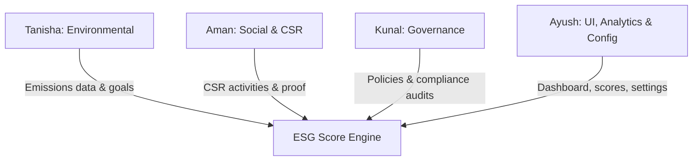

# EcoSphere: ESG Management Platform

EcoSphere is an Environmental, Social, and Governance (ESG) management platform designed to integrate sustainability metrics, employee participation, and compliance tracking directly into day-to-day ERP operations.

---


## 1. 8-Hour Demo Goals (MVP Checklist)
To successfully demonstrate the concept, the MVP must deliver:
- [ ] **Login**: Secure JWT-based authentication for employees, managers, and admins.
- [ ] **Dashboard**: A unified executive overview showing ESG scores (Environmental, Social, Governance, and Overall), recent activities, quick action links, and departmental rankings.
- [ ] **Add ESG Data**: Simplified data entry forms for emissions activity (Purchases, Mfg, Expense, Fleet), CSR activity logs, and policy updates.
- [ ] **ESG Score Calculation**: Real-time, rule-based calculation of departmental and organizational scores.
- [ ] **Charts**: Visual trends of carbon emissions and CSR participation rates.
- [ ] **Report Page**: Custom report builder allowing users to apply filters (date, department, module) and export summaries.
- [ ] **Clean UI**: A cohesive, premium layout styled with vanilla CSS featuring smooth transitions and dark/glassmorphic elements.

---

## 2. Work Division & Developer Assignments

The development workload is split into four distinct modules:



### 👤 Tanisha: Environmental Module
* **Scope**: Carbon accounting, emission factors configuration, and sustainability targets.
* **Assigned Features**:
  - Auto-calculation of emissions from linked ERP operations.
  - Emission factor settings and product-linked ESG profiles.
  - Tracking environmental goals vs. actual values.

### 👤 Aman: Social & CSR Module
* **Scope**: Corporate Social Responsibility (CSR) events, employee signups, and voluntary engagement tracking.
* **Assigned Features**:
  - CSR activity catalog and registration.
  - Validation engine for proof/evidence uploads.
  - Employee participation lifecycle and verification flow.

### 👤 Kunal: Governance & Compliance Module
* **Scope**: Policy tracking, audits, compliance alerts, and notification dispatches.
* **Assigned Features**:
  - Policy management and digital acknowledgements.
  - Audit logging and compliance issue escalation (due date tracking).
  - Centralized notification service (sends in-app/email alerts for reviews, badge unlocks, and compliance breaches).

### 👤 Ayush: UI, Score Aggregation, Reports & Settings (Lead Architect)
* **Scope**: Application dashboard, score calculation, charts, report builder, gamification, and settings.
* **Assigned Features**:
  - Core layouts (Dashboard, Login, Reports) with responsive vanilla CSS.
  - Score Calculation Engine (Department & Global ESG score formulas).
  - Gamification rules (XP accrual, automated badge award, reward redemption).
  - Global configuration switches.

---

## 3. Data Models & Database Schema

### Master Data

#### Department
* `id`: UUID (Primary Key)
* `name`: String
* `code`: String (Unique)
* `head_id`: UUID (Foreign Key to Employee)
* `parent_department_id`: UUID (Self-referencing Foreign Key)
* `employee_count`: Integer
* `status`: Enum (`active`, `inactive`)

#### Category
* `id`: UUID (Primary Key)
* `name`: String
* `type`: Enum (`csr_activity`, `challenge`)
* `status`: Enum (`active`, `inactive`)

#### Emission Factor
* `id`: UUID (Primary Key)
* `activity_source`: String (e.g., `electricity`, `gasoline`, `steel_manufacturing`)
* `factor`: Float (CO2 equivalent value)
* `unit`: String (e.g., `kg_co2_per_kwh`, `kg_co2_per_kg`)
* `status`: Enum (`active`, `inactive`)

#### Product ESG Profile
* `id`: UUID (Primary Key)
* `product_name`: String
* `product_code`: String (Unique)
* `carbon_footprint`: Float (CO2 equivalent value per product unit)
* `resource_efficiency_score`: Integer (1-100)

#### Environmental Goal
* `id`: UUID (Primary Key)
* `name`: String
* `department_id`: UUID (Foreign Key to Department)
* `target_value`: Float (Target CO2 emissions in kg)
* `current_value`: Float (Current CO2 emissions in kg)
* `deadline`: Date
* `status`: Enum (`active`, `achieved`, `missed`)

#### ESG Policy
* `id`: UUID (Primary Key)
* `title`: String
* `content`: Text
* `version`: String
* `effective_date`: Date
* `status`: Enum (`draft`, `active`, `archived`)

#### Badge
* `id`: UUID (Primary Key)
* `name`: String
* `description`: String
* `unlock_rule`: JSONB (e.g., `{"metric": "xp", "value": 500}` or `{"metric": "challenges", "value": 5}`)
* `icon`: String (URL or asset path)

#### Reward
* `id`: UUID (Primary Key)
* `name`: String
* `description`: String
* `points_required`: Integer
* `stock`: Integer
* `status`: Enum (`active`, `out_of_stock`, `inactive`)

---

### Transactional Data

#### Carbon Transaction
* `id`: UUID (Primary Key)
* `erp_reference`: String (e.g., Invoice Number, Work Order ID)
* `department_id`: UUID (Foreign Key to Department)
* `source_type`: Enum (`purchase`, `manufacturing`, `expense`, `fleet`)
* `activity_amount`: Float (Quantity of fuel consumed, weight of raw material, etc.)
* `emission_factor_id`: UUID (Foreign Key to Emission Factor)
* `calculated_emissions`: Float (CO2 in kg)
* `transaction_date`: DateTime

#### CSR Activity
* `id`: UUID (Primary Key)
* `title`: String
* `description`: String
* `category_id`: UUID (Foreign Key to Category)
* `points_awarded`: Integer
* `max_participants`: Integer
* `date`: DateTime
* `status`: Enum (`draft`, `active`, `completed`, `cancelled`)

#### Employee Participation
* `id`: UUID (Primary Key)
* `employee_id`: UUID (Foreign Key to Employee)
* `activity_id`: UUID (Foreign Key to CSR Activity)
* `proof_url`: String (Nullable)
* `approval_status`: Enum (`pending`, `approved`, `rejected`)
* `points_earned`: Integer
* `completion_date`: DateTime (Nullable)

#### Challenge
* `id`: UUID (Primary Key)
* `title`: String
* `category_id`: UUID (Foreign Key to Category)
* `description`: String
* `xp_reward`: Integer
* `difficulty`: Enum (`easy`, `medium`, `hard`)
* `evidence_required`: Boolean
* `deadline`: DateTime
* `status`: Enum (`draft`, `active`, `under_review`, `completed`, `archived`)

#### Challenge Participation
* `id`: UUID (Primary Key)
* `challenge_id`: UUID (Foreign Key to Challenge)
* `employee_id`: UUID (Foreign Key to Employee)
* `progress`: Integer (Percentage 0-100)
* `proof_url`: String (Nullable)
* `approval_status`: Enum (`pending`, `approved`, `rejected`)
* `xp_awarded`: Integer

#### Policy Acknowledgement
* `id`: UUID (Primary Key)
* `policy_id`: UUID (Foreign Key to ESG Policy)
* `employee_id`: UUID (Foreign Key to Employee)
* `acknowledged_at`: DateTime

#### Audit
* `id`: UUID (Primary Key)
* `name`: String
* `date`: Date
* `scope`: String
* `auditor`: String
* `findings`: Text
* `status`: Enum (`draft`, `in_progress`, `completed`)

#### Compliance Issue
* `id`: UUID (Primary Key)
* `audit_id`: UUID (Foreign Key to Audit)
* `severity`: Enum (`low`, `medium`, `high`, `critical`)
* `description`: Text
* `owner_id`: UUID (Foreign Key to Employee)
* `due_date`: Date
* `status`: Enum (`open`, `resolved`, `overdue`)

#### Department Score
* `id`: UUID (Primary Key)
* `department_id`: UUID (Foreign Key to Department)
* `environmental_score`: Float (0-100)
* `social_score`: Float (0-100)
* `governance_score`: Float (0-100)
* `total_score`: Float (0-100)
* `updated_at`: DateTime

---

## 4. Score Calculation Formulas & Business Rules

### 📊 Score Calculation Engine (Ayush)

#### 1. Environmental Score ($E_{dept}$)
Calculated based on actual carbon emissions compared against target goals.
$$E_{dept} = \max\left(0, 100 \times \left(1 - \frac{\text{Sum of Calculated Emissions}}{\text{Sum of Environmental Goal Targets}}\right)\right)$$
*If no goal is defined for the department, a default base score of 50 is assigned.*

#### 2. Social Score ($S_{dept}$)
Calculated from CSR activity participation rates and training/acknowledgement completions.
$$S_{dept} = \left(0.6 \times \frac{\text{Approved Participations}}{\text{Total Employees in Dept}}\right) + \left(0.4 \times \frac{\text{Completed Policies}}{\text{Total Assigned Policies}}\right) \times 100$$
*Capped at 100.*

#### 3. Governance Score ($G_{dept}$)
Calculated by deducting penalties from a starting score of 100.
$$G_{dept} = 100 - (\text{Open Compliance Issues} \times 10) - (\text{Overdue Compliance Issues} \times 25)$$
*Bounded between 0 and 100.*

#### 4. Department Total Score ($T_{dept}$)
A weighted average of environmental, social, and governance scores:
$$T_{dept} = (W_{env} \times E_{dept}) + (W_{soc} \times S_{dept}) + (W_{gov} \times G_{dept})$$
*Default weights: $W_{env} = 0.40$, $W_{soc} = 0.30$, $W_{gov} = 0.30$ (configurable in Settings).*

#### 5. Overall ESG Score
Weighted average of all Department Total Scores based on employee headcount:
$$\text{Overall Score} = \frac{\sum (T_{dept} \times \text{Employee Count}_{dept})}{\sum \text{Employee Count}_{dept}}$$

---

### ⚙️ Core Configuration & Business Logic

1. **Auto Emission Calculation (Tanisha)**:
   * **Rule**: When `settings.auto_emission_calculation` is enabled, inserting a Purchase/Mfg/Expense/Fleet record triggers an API call that multiplies `activity_amount` by the matching `Emission Factor` to populate `calculated_emissions` in the `Carbon Transaction` table.
2. **Evidence Requirement (Aman)**:
   * **Rule**: When `settings.evidence_requirement` is enabled, an employee's `Employee Participation` or `Challenge Participation` record cannot transition from `pending` to `approved` unless `proof_url` is non-null.
3. **Badge Auto-Award (Ayush)**:
   * **Rule**: Whenever an employee updates their XP or completes a challenge, a background routine checks if their current totals satisfy any `Badge.unlock_rule`. If yes, a new badge assignment record is created, and a notification is dispatched.
4. **Compliance Overdue Escalation (Kunal)**:
   * **Rule**: Daily cron job checks all open `Compliance Issues`. If `current_date > due_date` and `status == 'open'`, the status changes to `overdue`, a notification is sent to the `owner`, and the department's Governance Score recalculation is triggered.

---

## 5. API Specification

All endpoints are prefixed with `/api/v1`. Bearer JWT authentication is required for all paths unless marked public.

### 🔐 Authentication (Ayush)

#### `POST /auth/login` (Public)
* **Description**: Log in with credentials and obtain a JWT access token.
* **Request Body**:
  ```json
  {
    "email": "employee@company.com",
    "password": "secure_password"
  }
  ```
* **Response (200 OK)**:
  ```json
  {
    "token": "eyJhbGciOiJIUzI1NiIsIn...",
    "user": {
      "id": "c1f7b88e-4a6f-474d-91b6-d249de6593a1",
      "name": "Jane Doe",
      "role": "employee",
      "department_id": "a82df99b-3129-4e78-bc84-938fd8cbb62c"
    }
  }
  ```

---

### 💼 Department & Scores Management (Ayush)

#### `GET /departments`
* **Description**: Retrieve list of organization departments.
* **Response (200 OK)**:
  ```json
  [
    {
      "id": "a82df99b-3129-4e78-bc84-938fd8cbb62c",
      "name": "Logistics",
      "code": "LOG-01",
      "employee_count": 45,
      "status": "active"
    }
  ]
  ```

#### `GET /departments/scores`
* **Description**: Retrieve the ESG scores for all departments and overall company summary.
* **Response (200 OK)**:
  ```json
  {
    "overall": {
      "environmental_score": 82.5,
      "social_score": 74.0,
      "governance_score": 85.0,
      "total_score": 81.0
    },
    "departments": [
      {
        "department_id": "a82df99b-3129-4e78-bc84-938fd8cbb62c",
        "name": "Logistics",
        "environmental_score": 80.0,
        "social_score": 70.0,
        "governance_score": 90.0,
        "total_score": 80.0
      }
    ]
  }
  ```

---

### 🌿 Environmental API (Tanisha)

#### `POST /carbon-transactions`
* **Description**: Log a carbon emitting operation from ERP.
* **Request Body**:
  ```json
  {
    "erp_reference": "PO-90823",
    "department_id": "a82df99b-3129-4e78-bc84-938fd8cbb62c",
    "source_type": "fleet",
    "activity_amount": 120.5,
    "emission_factor_id": "31fe7ab2-d6c5-412e-9d29-c45fe1239aa8",
    "transaction_date": "2026-07-12T10:00:00Z"
  }
  ```
* **Response (201 Created)**: Returns the transaction with `calculated_emissions` filled.

#### `POST /carbon-transactions/calculate`
* **Description**: Preview carbon calculation based on hypothetical activity amounts.
* **Request Body**:
  ```json
  {
    "source_type": "fleet",
    "activity_amount": 120.5,
    "emission_factor_id": "31fe7ab2-d6c5-412e-9d29-c45fe1239aa8"
  }
  ```
* **Response (200 OK)**:
  ```json
  {
    "calculated_emissions": 322.94,
    "unit": "kg_co2"
  }
  ```

---

### 🤝 Social & CSR API (Aman)

#### `POST /csr-activities`
* **Description**: Create a new company CSR event.
* **Request Body**:
  ```json
  {
    "title": "Tree Plantation Drive",
    "description": "Planting saplings in the local community park.",
    "category_id": "e828f321-df39-4d2a-89a1-89bda532a893",
    "points_awarded": 50,
    "max_participants": 20,
    "date": "2026-07-20T08:00:00Z"
  }
  ```

#### `POST /csr-activities/{id}/participate`
* **Description**: Join an active CSR initiative.
* **Request Body** (optional multipart form for evidence upload):
  ```json
  {
    "proof_url": "https://storage.ecosphere.local/proofs/tree_planting.jpg"
  }
  ```
* **Response (201 Created)**: Returns the participation record.

#### `PUT /csr-participations/{id}` (Manager/Admin Only)
* **Description**: Approve or reject a participation request.
* **Request Body**:
  ```json
  {
    "approval_status": "approved"
  }
  ```

---

### 🛡️ Governance & Auditing API (Kunal)

#### `POST /compliance-issues` (Auditor/Manager Only)
* **Description**: Create a violation issue detected during audit.
* **Request Body**:
  ```json
  {
    "audit_id": "a87fd1b9-3b9a-4c28-bb8d-ee9d249de659",
    "severity": "high",
    "description": "Unsecured hazardous waste containers stored behind depot 3.",
    "owner_id": "c1f7b88e-4a6f-474d-91b6-d249de6593a1",
    "due_date": "2026-08-01"
  }
  ```

#### `POST /policies/{id}/acknowledge`
* **Description**: Log employee policy confirmation.
* **Response (200 OK)**:
  ```json
  {
    "status": "success",
    "acknowledged_at": "2026-07-12T10:48:00Z"
  }
  ```

---

### 🏆 Gamification & Rewards API (Ayush)

#### `GET /leaderboard`
* **Description**: Retrieve overall employee standings sorted by accumulated XP/points.
* **Response (200 OK)**:
  ```json
  [
    { "rank": 1, "employee_name": "Aman Verma", "xp": 1250, "department": "Logistics" },
    { "rank": 2, "employee_name": "Tanisha Sen", "xp": 1100, "department": "Environmental" }
  ]
  ```

#### `POST /rewards/{id}/redeem`
* **Description**: Exchange employee XP for points/rewards.
* **Response (200 OK)**:
  ```json
  {
    "status": "success",
    "remaining_points": 750,
    "reward_claimed": "Eco-friendly Water Bottle"
  }
  ```

---

### 📊 Reports & Configuration (Ayush)

#### `POST /reports/custom`
* **Description**: Compile and export dynamically filtered data.
* **Request Body**:
  ```json
  {
    "filters": {
      "department_id": "a82df99b-3129-4e78-bc84-938fd8cbb62c",
      "date_range": { "start": "2026-01-01", "end": "2026-06-30" },
      "modules": ["environmental", "social"]
    },
    "format": "pdf"
  }
  ```
* **Response**: Binary file stream (PDF/XLS/CSV) with correct `Content-Type` headers.

#### `PUT /settings` (Admin Only)
* **Description**: Modify organizational parameters.
* **Request Body**:
  ```json
  {
    "auto_emission_calculation": true,
    "evidence_requirement": true,
    "badge_auto_award": true,
    "weight_environmental": 0.40,
    "weight_social": 0.30,
    "weight_governance": 0.30
  }
  ```
